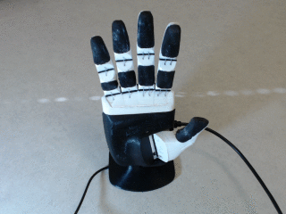
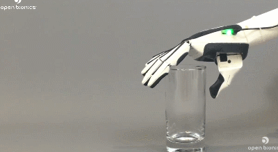
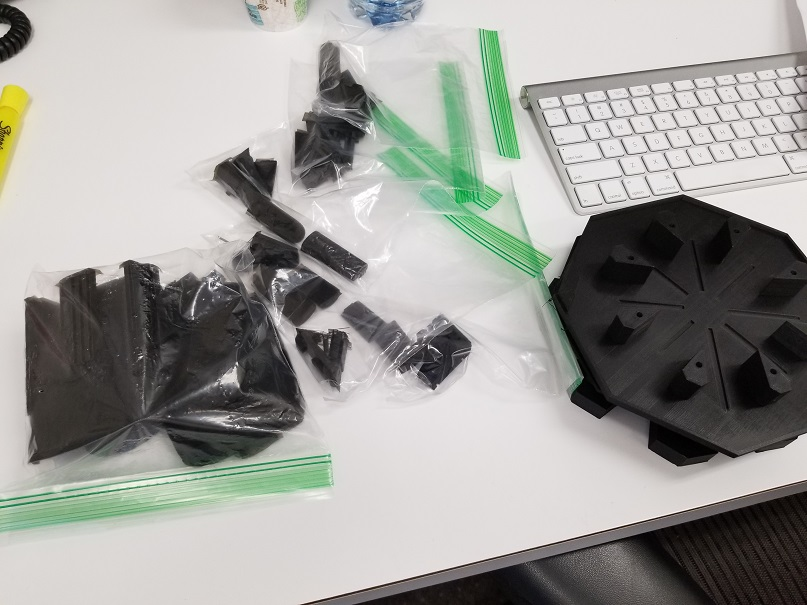
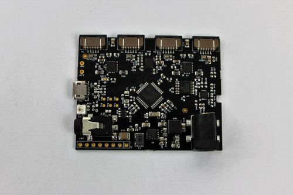

```{r setup, include=FALSE}
knitr::opts_chunk$set(echo = TRUE)
```

## OpenBionics Brunel Hand 2.0 Python Project (codename: MEGAHAND)

Our project seeks to build a workflow for reading skin-surface EMG (sEMG) signals in real time to control a robotic prosthetic hand with a useful degree of accuracy, and with a framework applicable to controlling hands made from stronger materials and for diversified prosthetic applications in the future. We sought to use exclusively open-source tools as part of an effort to make this work cost-effective for patients that may want one of their own. This keeps with the ethos of OpenBionics, and with learning about Python!






## Hand Parts 





## EMG


## Data

This produces a large data set of frequency readouts, that is then processed and fed into a machine learning algorithm to classify which sets of readouts correspond to which types of grips


## R packages

Tidyverse is a meta-package (a pack of packages) that is very commonly used in R, and then Tensorflow and Keras are used for Machine Learning. According to Martin, Keras was developed for Python, and then the same dev developed it for R, so it is a framework that can be used in both languages. That being said, we opted for scikit-learn.

```{r}
# install.packages("tidyverse")
# install.packages("tensorflow", dependencies = TRUE)
# install.packages("keras", dependencies = TRUE)

library(tidyverse)
# library(tensorflow)
# library(keras)
```

## R package for interoperability with Python

This package includes functions that allow you to reference Python objects in your R code, or source Python scripts from within R. I will show an example of this shortly.

```{r}
# install.packages("reticulate", dependencies = TRUE)
library(reticulate)
```


## Reticulate

With the reticulate package in R, Python code can be integrated into R documents and used alongside R. This is especially convenient in the RMarkdown document format for several reasons:

* R code and Python code can be called in discrete boxes, but within the same document

* Objects built in either environment can be passed back and forth between languages

* RMarkdown offers flexible export formats including pdf, slides, word, and html

This particular aspect of our project interested me due to the scale and diversity of challenges in interoperability, both of which I have yet to fully grasp.

## Python library imports, but in an RMarkdown document

Frequently, the autocomplete available with Python functions and syntax will work within a Python chunk in an RMarkdown document, but it is not seamless yet. The words are, however, highlighted and colored as they would be when working within a .py document (despite that not being the case in this slidy presentation)
```{python}
import numpy as np
import pandas as pd
import matplotlib.pyplot as plt
import rpytools as rpy
```

## Exploratory Data Analysis and Visualization

This is a Python script that grabs all of the ".csv" files in a folder, and makes a list of the names. The script is saved as "TrainingDataGrabber.py"

From the documentation for the glob() function:

The glob module finds all the pathnames matching a specified pattern according to the rules used by the Unix shell, although results are returned in arbitrary order. No tilde expansion is done, but *, ?, and character ranges expressed with [] will be correctly matched. This is done by using the os.scandir() and fnmatch.fnmatch() functions in concert, and not by actually invoking a subshell. Note that unlike fnmatch.fnmatch(), glob treats filenames beginning with a dot (.) as special cases. (For tilde and shell variable expansion, use os.path.expanduser() and os.path.expandvars().)
```{python, eval = FALSE}
import os
import glob

path = 'c:\\'
extension = 'csv'
os.chdir(path= "C:/Users/joeje/Desktop/Academics/FAES/Intro_to_Python/MEGAHAND/TrainingData")
Training_Data_Files = [i for i in glob.glob('*.{}'.format(extension))]
print(Training_Data_Files)
```

## Using Reticulate to source a Python Script

Here, I used R to source the Python script, create a list object containing all of the file names in the "TrainingData" folder, and then coerced an R DataFrame from that Python list for display.

```{r, warning = FALSE}
reticulate::source_python("TrainingDataGrabber.py")

Training_Data_Files

knitr::kable(as.data.frame(Training_Data_Files))
```

## Using R for data tidying and visualization

Next, I used the purrr package from R to apply a function I made in R that tidys the data (removing extraneous columns and formatting) and then creates a pre-set visualization for all of the files from the list (that was made in Python.)

```{r message=FALSE, warning=FALSE}
source("C:/Users/joeje/Desktop/Academics/FAES/Intro_to_Python/MEGAHAND/Megamunge_Jitter.R")
library(purrr)
setwd('TrainingData')
map(Training_Data_Files, Megamunge)
```


