```{r setup, include=FALSE, cache=TRUE}
knitr::opts_chunk$set(echo = TRUE, cache=TRUE)
```

## OpenBionics Brunel Hand 2.0 Python Project (codename: MEGAHAND)

Our project seeks to build a workflow for reading skin-surface EMG (sEMG) signals in real time to control a robotic prosthetic hand with a useful degree of accuracy, and with a framework applicable to controlling hands made from stronger materials and for diversified prosthetic applications in the future. We sought to use exclusively open-source tools as part of an effort to make this work cost-effective for patients that may want one of their own. This keeps with the ethos of OpenBionics, and with learning about Python!

<table>
<tr>
<td>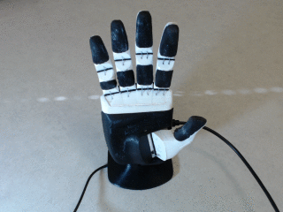</td><td>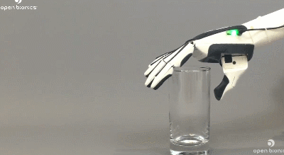</td>
</tr></table>

## Hand Parts 

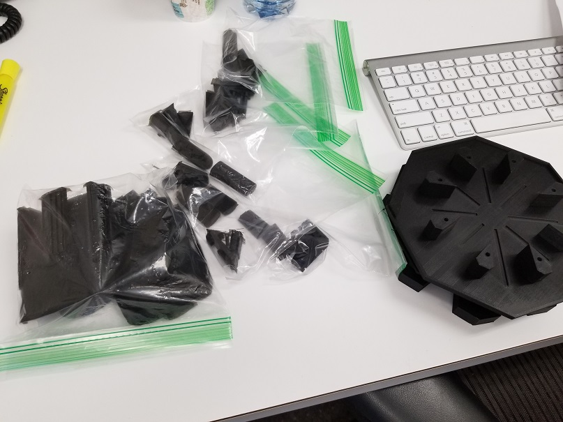

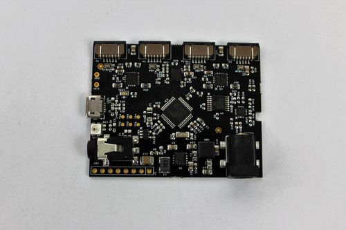

## EMG

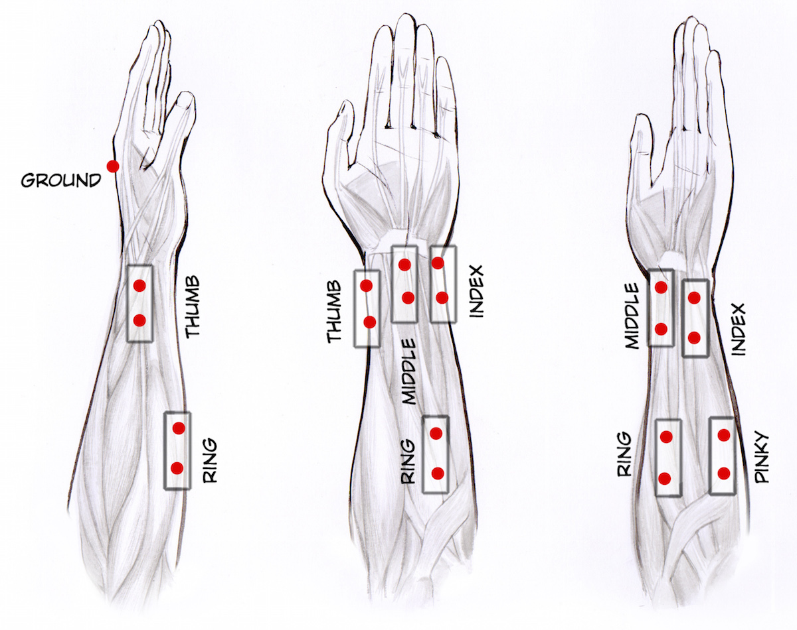


## Data

This produces a large data set of potential energy readouts, that is then processed and fed into a machine learning algorithm to classify which sets of readouts correspond to which types of grips. The data is observations across time, and is therefore Time-Series Data. 

```{python}
import pandas as pd
ChuckGrip = pd.read_csv("TrainingData/Chuck Grip.csv")
print(pd.DataFrame.head(ChuckGrip))
```


## R packages

Tidyverse is a meta-package (a pack of packages) that is very commonly used in R, and then Tensorflow and Keras are used for Machine Learning. According to Martin, Keras was developed by Francois Chollet for deep learning in Python, but he then moved to develop  R, so it is a framework that can be used in both languages. That being said, we opted for scikit-learn.

```{r}
# install.packages("tidyverse")
# install.packages("tensorflow", dependencies = TRUE)
# install.packages("keras", dependencies = TRUE)

library(tidyverse)
# library(tensorflow)
# library(keras)
```

R package for interoperability with Python

```{r}
# install.packages("reticulate", dependencies = TRUE)
library("reticulate", lib.loc="~/R/win-library/3.5")
```

This package includes functions that allow you to reference Python objects in your R code, or source Python scripts from within R. I will show an example of this shortly.


## Reticulate

With the reticulate package in R, Python code can be integrated into R documents and used alongside R. This is especially convenient in the RMarkdown document format for several reasons:

* R code and Python code can be called in discrete boxes, but within the same document

* Objects built in either environment can be passed back and forth between languages

* RMarkdown offers flexible export formats including pdf, slides, word, and html

This particular aspect of our project interested me due to the scale and diversity of challenges in interoperability, both of which I have yet to fully grasp.

## Python library imports, but in an RMarkdown document

Frequently, the autocomplete available with Python functions and syntax will work within a Python chunk in an RMarkdown document, but it is not seamless yet. The words are, however, highlighted and colored as they would be when working within a .py document (despite that not being the case in this slidy presentation)
```{python}
import numpy as np
import pandas as pd
import matplotlib.pyplot as plt
import rpytools as rpy
```

## Exploratory Data Analysis and Visualization

This is a Python script that grabs all of the ".csv" files in a folder, and makes a list of the names. The script is saved as "TrainingDataGrabber.py"

From the documentation for the glob() function:

The glob module finds all the pathnames matching a specified pattern according to the rules used by the Unix shell, although results are returned in arbitrary order. No tilde expansion is done, but *, ?, and character ranges expressed with [] will be correctly matched. This is done by using the os.scandir() and fnmatch.fnmatch() functions in concert, and not by actually invoking a subshell. Note that unlike fnmatch.fnmatch(), glob treats filenames beginning with a dot (.) as special cases. (For tilde and shell variable expansion, use os.path.expanduser() and os.path.expandvars().)
```{python, eval = FALSE}
import os
import glob

path = 'c:\\'
extension = 'csv'
os.chdir(path= "C:/Users/joeje/Desktop/Academics/FAES/Intro_to_Python/MEGAHAND/TrainingData")
Training_Data_Files = [i for i in glob.glob('*.{}'.format(extension))]
print(Training_Data_Files)
```

## Using Reticulate to source a Python Script

Here, I used R to source the Python script, create a list object containing all of the file names in the "TrainingData" folder, and then coerced an R DataFrame from that Python list for display.

```{r, warning = FALSE}
reticulate::source_python("TrainingDataGrabber.py")

Training_Data_Files

knitr::kable(as.data.frame(Training_Data_Files))
```

## Using R for data tidying and visualization

Next, I used the purrr package from R to apply a function I made in R that tidys the data (removing extraneous columns and formatting) and then creates a pre-set visualization for all of the files from the list (that was made in Python.)

```{r message=FALSE, warning=FALSE}
source("C:/Users/joeje/Desktop/Academics/FAES/Intro_to_Python/MEGAHAND/Megamunge_Jitter.R")
library(purrr)
setwd('TrainingData')
map(Training_Data_Files, Megamunge)
```

## Impressions from EDA

* Different grips correlate to different voltage distributions
* Developing a classifier should be possible given input uniformity and a discrete number of grip types represented in data

## Principle Component Analysis

To utilize the and present Python scripts that members of the group made, the syntax should be as simple as:

```{r eval=FALSE}
reticulate::source_python("Noah_work_graphs/Noah_PCA.py")

reticulate::source_python("Noah_work_graphs/Noah_model_stats.py")
```

```{python eval = FALSE}

#%%
import numpy as np
import matplotlib.pyplot as plt
import pandas as pd
from sklearn.decomposition import PCA 
from sklearn.preprocessing import RobustScaler
from sklearn.pipeline import make_pipeline

import os
import glob
path = 'c:\\'
extension = 'csv'
os.chdir(path= "C:/Users/joeje/Desktop/Academics/FAES/Intro_to_Python/MEGAHAND/TrainingData")
Training_Data_Files = [i for i in glob.glob('*.{}'.format(extension))]

print(Training_Data_Files)

'''Variance of PCA'''
def PCA_Variance(x):
    data=pd.read_csv(x).iloc[0:,0:8]
    scaler = RobustScaler()
    pca = PCA()
    pipeline = make_pipeline(scaler,pca)
    pipeline.fit(data)
    features = range(pca.n_components_)
    plt.bar(features, pca.explained_variance_)
    plt.xlabel('PCA feature')
    plt.ylabel('Variance')
    plt.title(x[:-4])
    plt.show()
    
for i in Training_Data_Files:
    PCA_Variance(i)
```

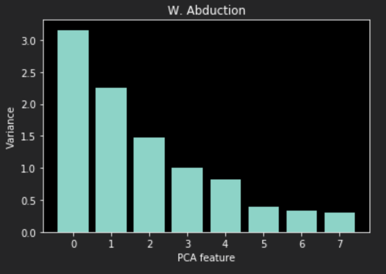
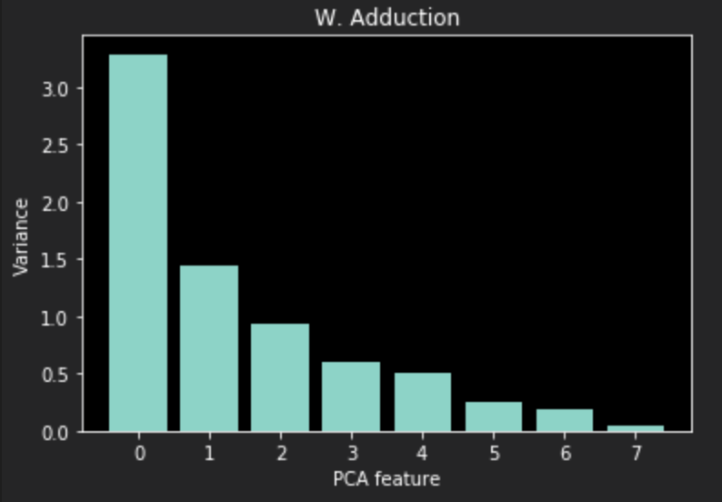
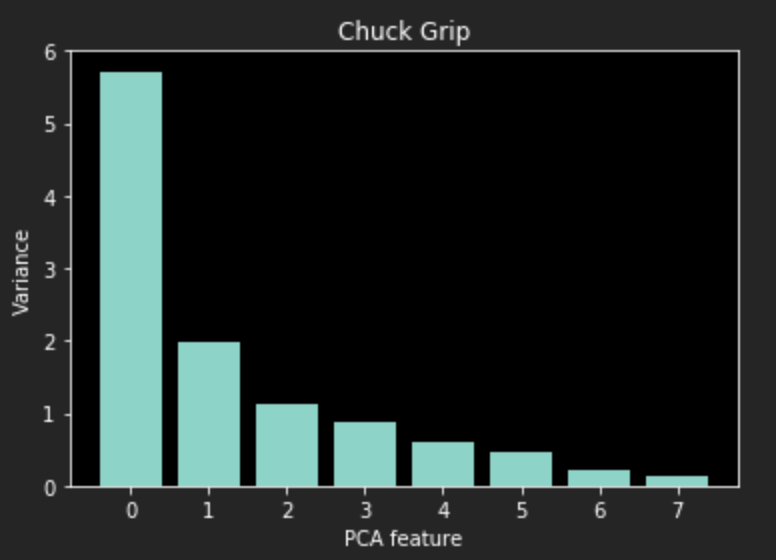
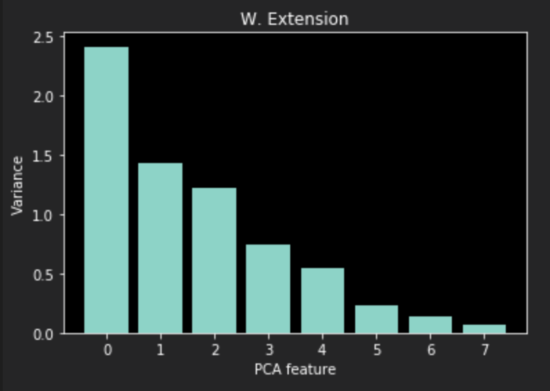
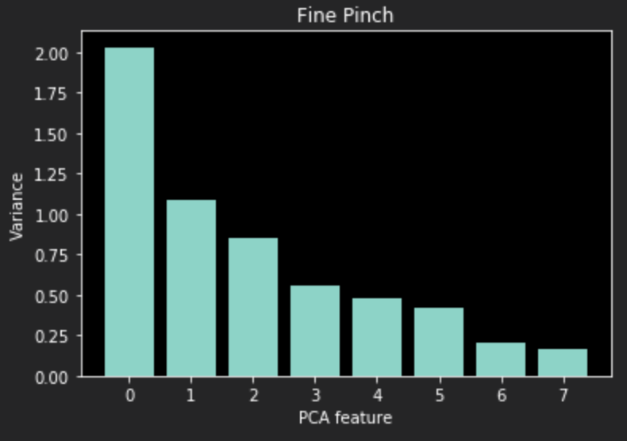
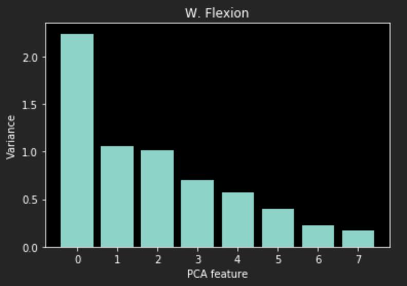
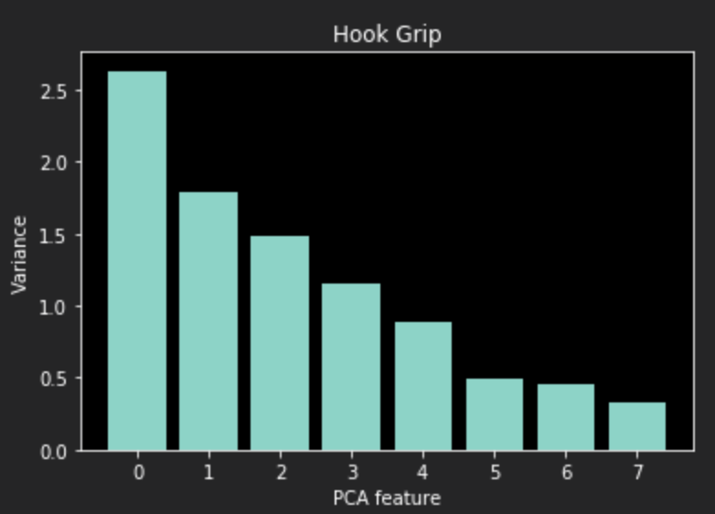
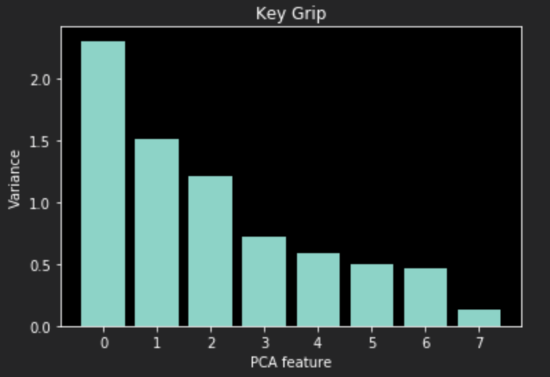
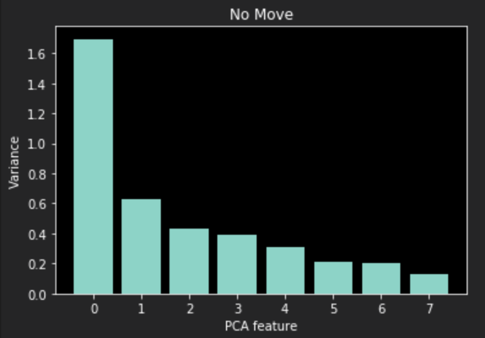
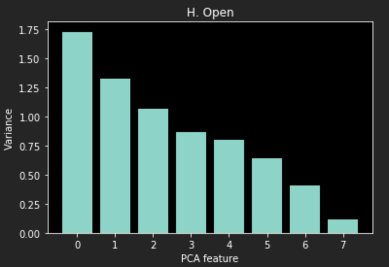
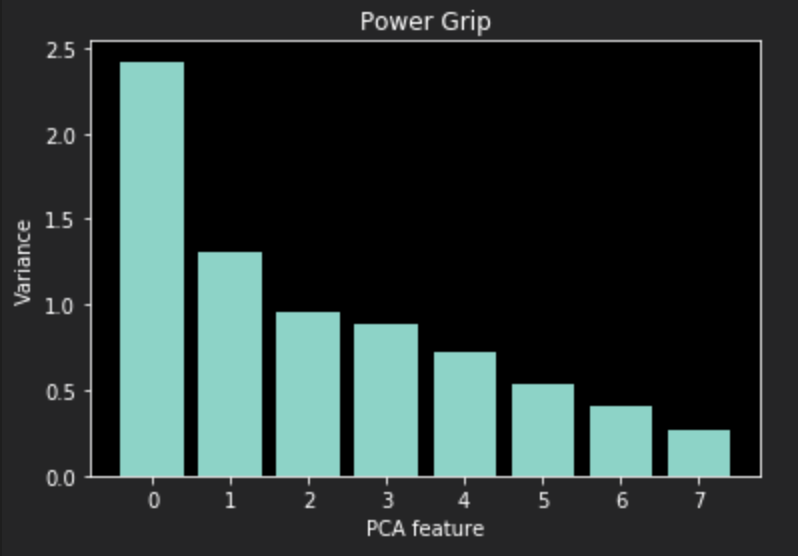

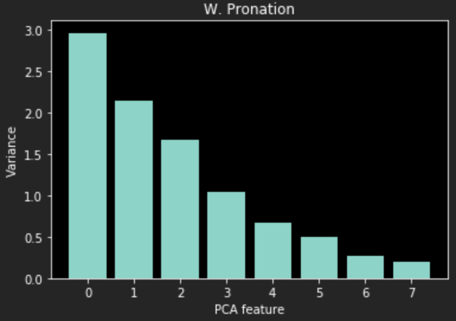
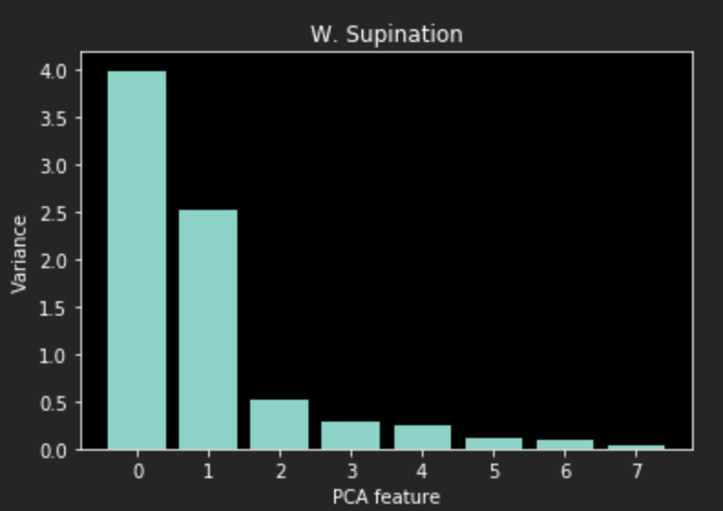
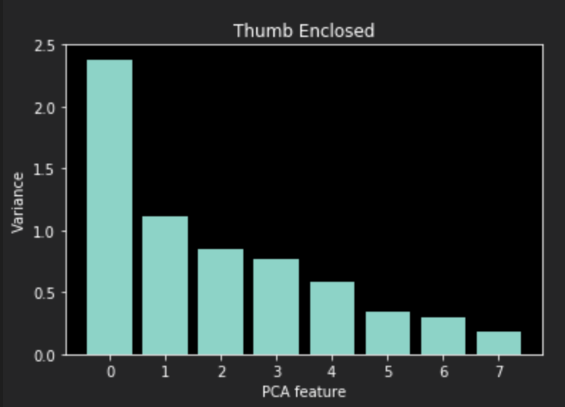
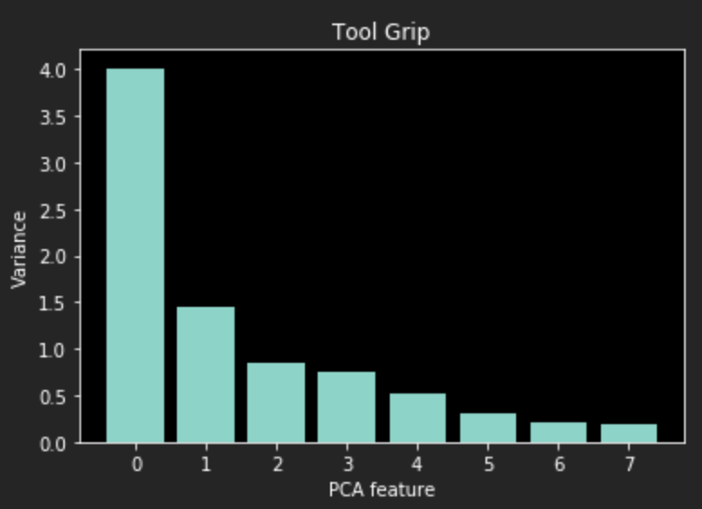


## Model Statistics
```{python eval = FALSE}
#%%
def model_stats(models):
    precision=[pd.read_csv(i).iloc[-1,1] for i in models]
    recall=[pd.read_csv(i).iloc[-1,2] for i in models]
    f1=[pd.read_csv(i).iloc[-1,3] for i in models]
    labels=[i[:-4] for i in models]
    
    plt.bar(labels, precision, color="red")
    plt.xticks(rotation=65)
    plt.xlabel("Model")
    plt.ylabel("True Positives/ Total Positives")
    plt.title("Precision")
    plt.show()
    plt.bar(labels, recall, color= "blue")
    plt.xticks(rotation=65)
    plt.xlabel("Model")
    plt.ylabel("True Positives/ False Negatives")
    plt.title("Recall")
    plt.show()
    plt.bar(labels, f1, color="green")
    plt.xticks(rotation=65)
    plt.xlabel("Model")
    plt.ylabel("F1_Score")
    plt.title("F1_Score")
    plt.show()

#%%
model_stats(models)
```

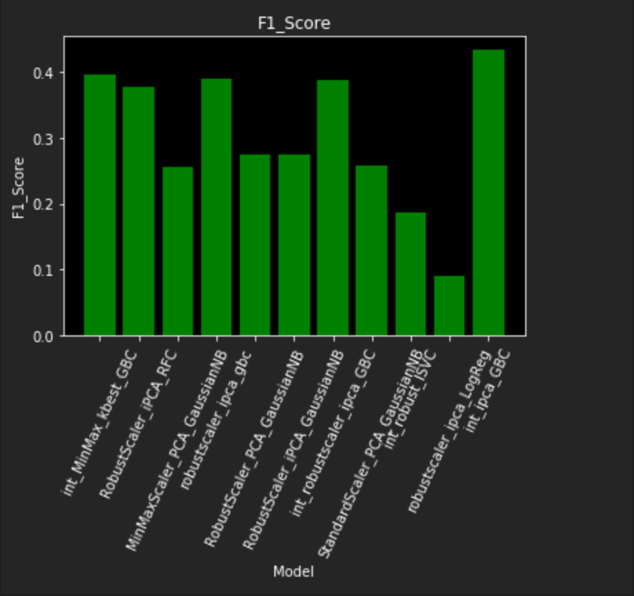
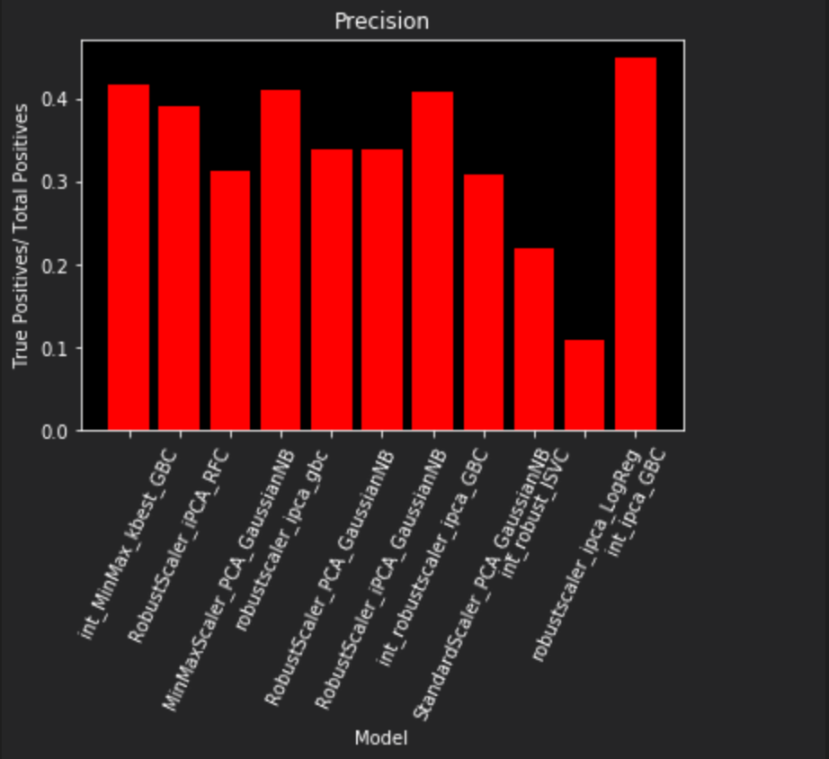
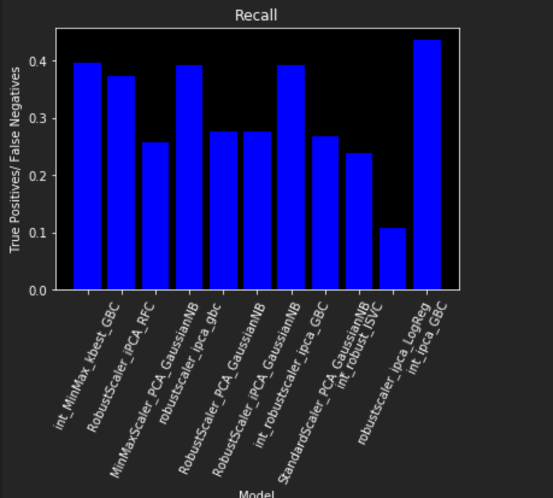

## Machine Learning

```{python eval = FALSE}
""" A Script for training a machine learning model on data
Standard pipelines and GridSearchCV are used.

The pipeline elemets were selected by scoring multiple elements with minimal tuning. 
The RobustScaler is less effected by outliers than other options.
PolynomialFeatures adds interaction terms
GradientBoostingClassifiers perform better (generally) than the equivalent RandomForest

Within GBC, parameters were chosen as follows:
High n_estimators with early stopping finds a good balance between computation time and performance
    by preventing overfitting
Presorting increases computation speed
Subsampling, leading to stochastic GBC, increases speed while helping to prevent overfitting
    Value of 0.5 is standard
Decreasing max_features decreases variance and time, but increases bias.
    'sqrt' is middle ground between 'log2' and 'none'
Learning rate (shrinkage) < 1, and prefereably < 0.1, drastically increases performance at cost of time
max_depth limits the number of nodes in the trees. The range 4 <= x <= 8 is considered ideal.

Functions:
----------
concat_files(iterable) - reads in all files in iterable anc concatenates them into a single dataframe
"""

import pandas as pd
import numpy as np
from EDA import glob_data
from sklearn.preprocessing import PolynomialFeatures, RobustScaler
from sklearn.ensemble import GradientBoostingClassifier
from sklearn.pipeline import Pipeline
from sklearn.model_selection import GridSearchCV
from sklearn.metrics import classification_report, confusion_matrix
import pickle
# matplotlib needed to plot confusion matrixes and other plots
import matplotlib.pyplot as plt
# itertools neded for iterations
import itertools
def concat_files(iterable):
    """Concatenates all files in iterable into a single data frame
    Resets index along data frame
    Assumes column names are the same in all files

    Arguments:
    ----------
    iterable: Any iterable(list, generator, tuple, etc)
    List of file paths to data files

    Returns:
    --------
    df: pandas.core.frame.DataFrame
    Dataframe containing all files in a single frame
    """
    try:
        iterator = iter(iterable)
    except TypeError:
        print('Concat_files requires filepaths to be in an iterable')
    data = []
    for file in iterable: 
        data.append(pd.read_csv(file))
    df = pd.concat(data, ignore_index=True)
    return df


def plot_confusion_matrix(cm, classes,
          normalize=False, title='Confusion matrix', cmap=plt.cm.Blues):
    """
    This function prints and plots the confusion matrix.
    Normalization can be applied by setting `normalize=True`.
    Modified from : scikit-learn.org example code at: https://scikit-learn.org/stable/auto_examples/model_selection/plot_confusion_matrix.html
    Defining the function used to plot a confusion matrix, where input is:
    1) cm, the call to confusion matrix
    2) chosen classes
    3) whether the plot should be normalized or not
    4) the title
    5) cmap blues, a sequential color map from matplotlib
    6) an If statement,  where if the confusion matrix is normalized, determine which samples are labeled correctly
    7) an else statement, which prints a non-normalized confusion matrix
    8) a print statement, to print the confusion matrix in the terminal
    9) plt.imshow to display an image of the data, .title to give the image a title, and .colorbar to provide a color bar
    10) np.arange to display a non-normalized confusion matrix with evenly spaced elements
    11) x and y ticks to set the tick locations and labels for x and y axis
    12) formatting step with 'fmt' with .2 margin for normalized matrix, otherwise 'd' to not format the matrix
    """
    if normalize:
        cm = cm.astype('float') / cm.sum(axis=1)[:, np.newaxis]
        print("Normalized confusion matrix")
    
    else:
        print('Confusion matrix, without normalization')

    print(cm)

    plt.imshow(cm, interpolation='nearest', cmap=cmap)
    plt.title(title)
    plt.colorbar()
    tick_marks = np.arange(len(classes))
    plt.xticks(tick_marks, classes, rotation=45)
    plt.yticks(tick_marks, classes)

    fmt = '.2f' if normalize else 'd'
    # to plot text inside of cells, 'itertools.product' used to calculate the cartesian product, all ordered pairs
    thresh = cm.max() / 2.
    for i, j in itertools.product(range(cm.shape[0]), range(cm.shape[1])):
        plt.text(j, i, format(cm[i, j], fmt),
                 horizontalalignment="center",
                 color="white" if cm[i, j] > thresh else "black")

    plt.ylabel('True label')
    plt.xlabel('Predicted label')
    plt.tight_layout()


if __name__ == '__main__':
    # Read Data
    # Folder path should be location of training data on your system (Add Directory)
    data_train = pd.read_csv(r'')
    y_train = data_train.Action.values
    X_train = data_train.drop('Action', axis=1).values

    # Test Data
    # Folder path should be location of testing data on your system (Add Directory)
    file_list = glob_data(folder=r'')
    data_test = concat_files(file_list)
    y_test = data_test.Action.values
    X_test = data_test.drop('Action', axis=1).values
    labels = data_test.columns

    # Establish pipeline
    pl = Pipeline([('int', PolynomialFeatures(include_bias=False, interaction_only=True)),
                   ('scale', RobustScaler()),
                   ('clf', GradientBoostingClassifier(
                        n_estimators=1000, n_iter_no_change=5, 
                        tol=0.001, validation_fraction=0.2, presort=True, 
                        subsample=0.5, max_features='sqrt')
                    )])
    
    # establish gridsearchcv, cv=3 to save on computation
    param_grid = {'clf__learning_rate': [0.001, 0.01, 0.1, 0.5],
                  'clf__max_depth': [4, 6, 8]}
    cv = GridSearchCV(pl, param_grid=param_grid, cv=3)

    # train and retrieve best_parameters
    cv.fit(X_train, y_train)
    print(cv.best_params_)
    model = cv.best_estimator_

    # predict and score (Add directory)
    y_predict = model.predict(X_test)
    print(model.score(X_test, y_test))
    report = pd.DataFrame.from_dict(classification_report(y_test, y_predict, output_dict=True), orient='index')
    report.to_csv(r'')
    
    # Compute confusion matrix
    cnf_matrix = confusion_matrix(y_test, y_predict)
    np.set_printoptions(precision=2)

    # Plot non-normalized confusion matrix
    cm = confusion_matrix(y_test, y_predict)
    plt.figure()
    plot_confusion_matrix(cm, classes=labels,
    title='Confusion matrix, without normalization')

    plt.show()

    # Plot normalized confusion matrix
    plt.figure()
    plot_confusion_matrix(cm, classes=labels, normalize=True,
    title='Normalized confusion matrix')

    plt.show()

    # pickle model (Add Directory)
    with open(r'', 'wb') as file:
        pickle.dump(model, file)
 
```


## Confusion Matrices

* They Are a visualization of what a model had trouble classifying
* They are used to assess both the quality of the model, and to point toward certain weaknesses or certain specific classes that a model has trouble with

## Confusion Matrices
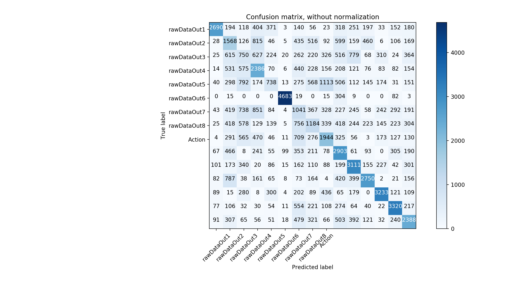

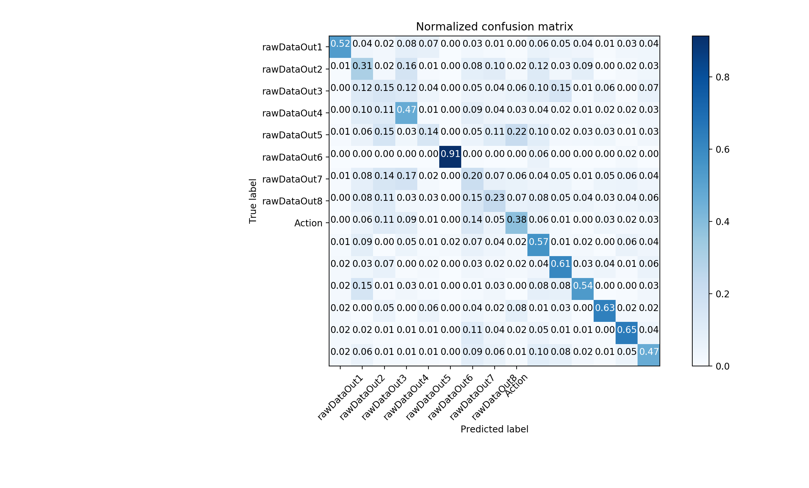


## Moving Forward

The next steps include:
* Model Optimization
* Mapping classifications to linear actuator pre-sets (this includes defining linear actuator pre-sets that would make the robotic hand simulate the grips)
* Arduino Integration into the code
* Streaming data from sEMG sensors to Python, into the classification model, and output to arduino


